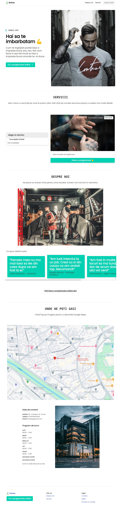
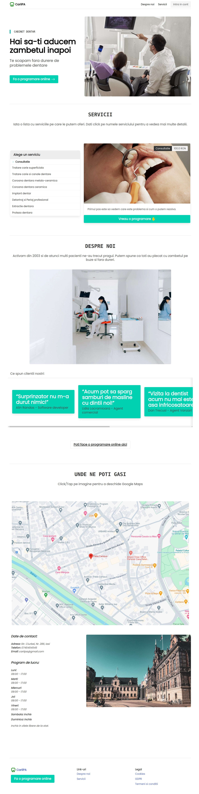
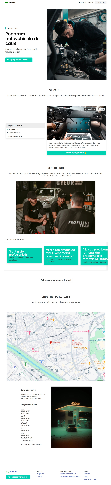
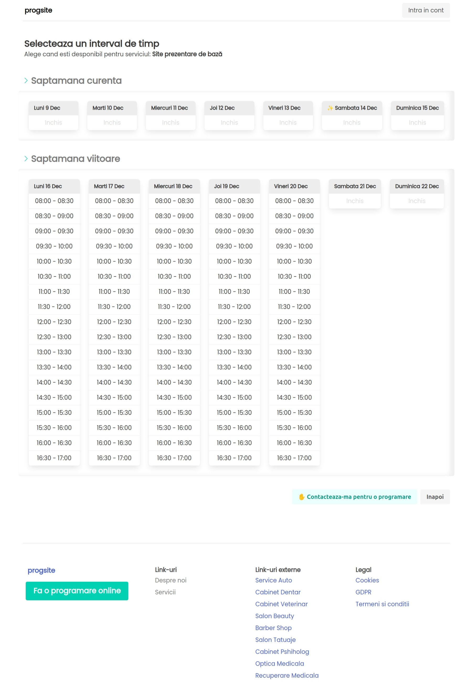
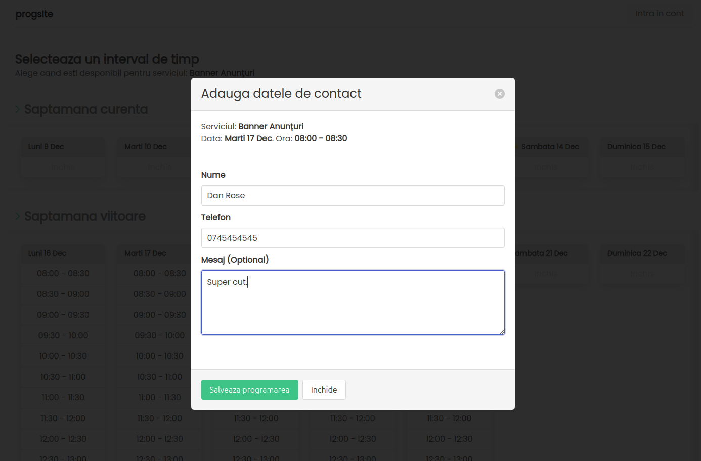
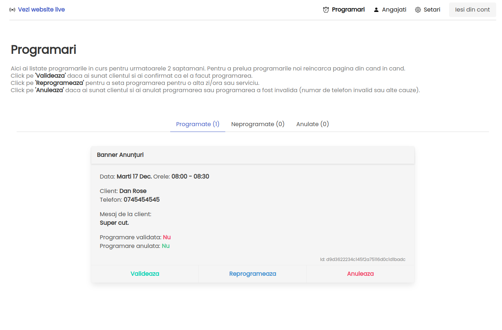
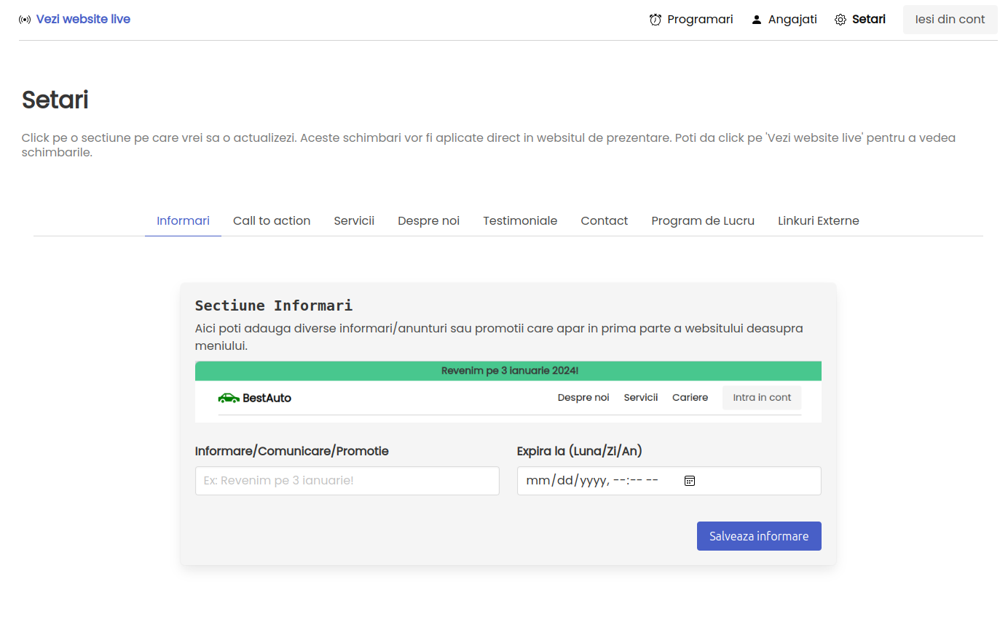
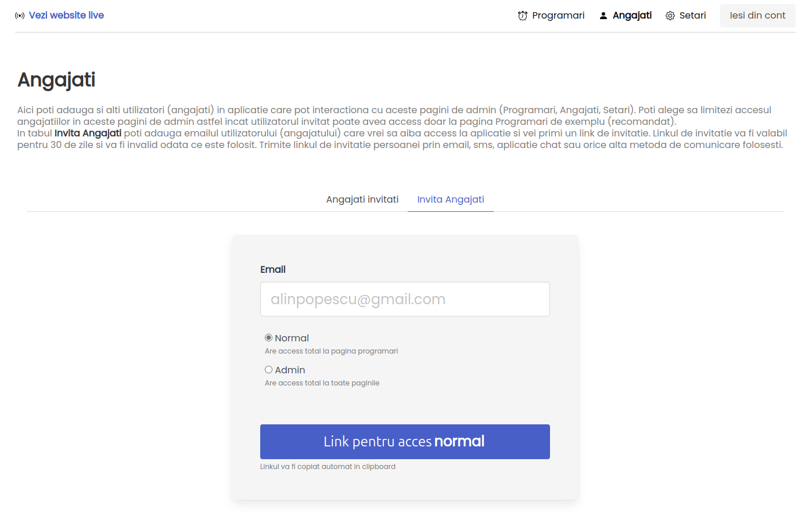

# Progsite

Landing page + Appointments in one website! Super useful for "brick and mortar" business that need to have an online presence and an appointment scheduler. Free to use!

Contact me if you need help with this at [softgata.com](https://softgata.com/). 
Please note this is at beta stage.

Features:
- update landing page template with your text, images and external links;
- add your working schedule;
- add google maps pin to your location;
- add services;
- add testimonials;
- make annoucements on the landing page; 
- let your clients make appointments easy on your website;
- invite employees on your website which can get appoinments as they come;

Here are a few example on how the landing page will look like. 
All text and images here can be modified from your account.

## Barber shop

## Dentist

## Repair Car shop

## Appointments
Here the clients can make an appointment for the span of current day up to 2 weeks. If they need to create an appointment after 2 week they can click the green button and can be contacted later. That's because if and appoinment is not in the near future then there is a high probability people won't show up.

When an user clicks on a hour interval he will need to fill this small contact form.

Then you or an employee can see the scheduled appointments in Appointments page. You can Validate the apointment by calling the user and confirming, you can call the client and reschedule or cancel the appointment.

In the Not scheduled tab you will see appointments that need to be done in the future (over 2 weeks from now).

## Settings

In this page you can fill any section of the landing page. Annoucements, CTA on hero section, images, add testimonials, fill about us section, add your contact details information for clients, add external links in the footer.

## Employees
Here you can add employees that can see appointments and work on them. All appointments will be in cronological order and will expire once they pass.

